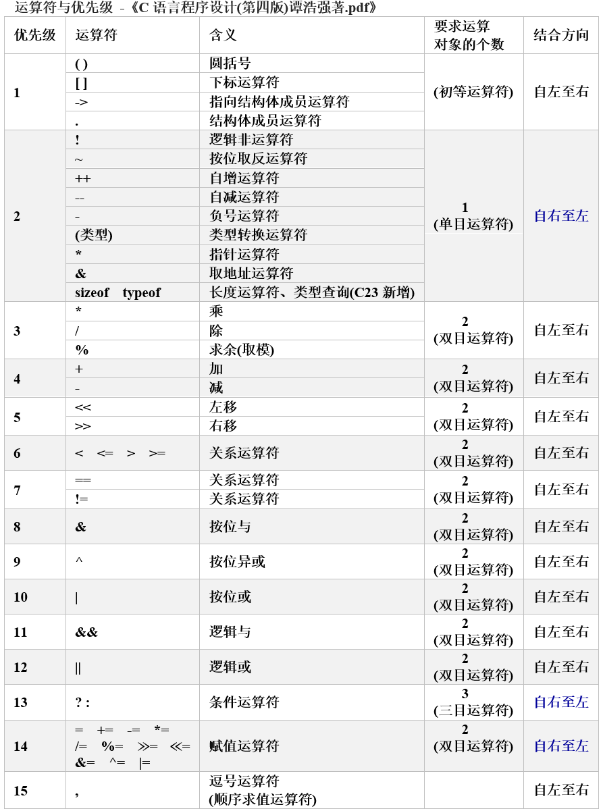

### **C语言运算符优先级表**
  

### **说明**

1.  **优先级与结合性**：同一优先级的多个运算符的优先级是一样的，运算次序由结合方向决定。
    *   例如 `*` 与 `/` 具有相同的优先级别，结合方向为自左至右，因此 `3*5/4` 的运算次序是先乘后除。
    *   `-` 和 `++` 为同一优先级，结合方向为自右至左，因此 `-i++` 相当于 `-(i++)`。

2.  **运算符类型（运算对象个数）**：
    *   双目运算符：如 `+` (加) 和 `-` (减)，要求在运算符两侧各有一个运算对象（如 `3+5`、`8-3`）。
    *   单目运算符：如 `++` 和 `-` (负号)，只能在运算符的一侧出现一个运算对象（如 `-a`、`i++`、`-i`、`(float)i`、`sizeof(int)`、`*p` 等）。
    *   三目运算符：条件运算符 `?:` 是 C 语言中唯一的三目运算符，如 `x?a:b`。

3.  **优先级归纳**：从上表中可以大致归纳出各类运算符的优先级（由上到下递减）：
    *   初等运算符 `() [] -> .`
    *   单目运算符
    *   算术运算符（先乘除，后加减）
    *   关系运算符
    *   逻辑运算符（不包括 `!`）
    *   条件运算符
    *   赋值运算符
    *   逗号运算符  
    **注**：初等运算符优先级最高，逗号运算符优先级最低。

4.  **特殊说明**：
    *   **位运算符的优先级**：比较分散（有的在算术运算符之前如 `~`，有的在关系运算符之前如 `<<` 和 `>>`，有的在关系运算符之后如 `&`、`^`、`\|`）。为了容易记忆，使用位运算符时可加圆括号。
    *   **结合方向**：单目、三目、赋值运算符的结合方向是 **自右至左**，其他都是 **自左至右**。
    *   **两种圆括号**：类型转换运算符 `(类型)` 和圆括号 `()`，字面上都是圆括号，但是两个不同运算符。根据圆括号里面的内容不同表示不同意义，**圆括号运算符 `()` 的优先级比强制类型转换 `(类型)` 高一级**。