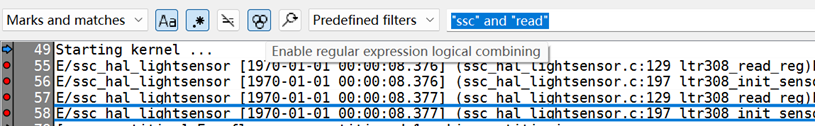

# 用法
•组合搜索：例如，查找包含 "ERROR" 但不包含 "Timeout" 的日志，搜索："ERROR" and not ("Timeout")。  
支持括号分组：("error" or "warning") and "server1" --只能用小写and/or，大写AND/OR报错KLOGG WARNING: failed to read some lines before this one，看来把大写AND/OR当做被搜索字符串了。并且，不支持not，与宣传的有差别。   
•多条件匹配：查找数据库连接错误或认证失败的日志："database.*error" or "authentication.*failed"  

("924" | "438")".\*event"  ---- 搜索924或438后跟event的行，.\* will match any sequence of characters on a single line  
写成("924" | "438")".\*event"正确，写成("924" or "438")".\*event"却报错，bug太多。  
---- 看来&|支持更好？  

and、or、not运算符，将选上，Enable regular expression logical combining，并且被搜索的字符串必须加上双引号，例如搜索同时包含ssc和read的行，输入"ssc" and "read"。  
  
 如果不加双引号会报错Error in expression: Patterns must be enclosed in quotes。很好理解，如果不加双引号，怎么知道是要搜索and这个字符串本身还是将and理解为运算符？  

# 快捷键
ctrl+shift+1~9 ：	为选中文本添加颜色标签  

ctrl+shift+f ： 高级搜索，和ctrl+s一样  
ctrl+f      ： 快捷搜索，和 '或"一样(单引号/双引号)  

ctrl+t、ctrl+1、2、3 ：在标签页之间切换  

\[ 、] ： 跳转到上一个/下一个标记行  

ctrl+l	：跳到指定行(L)  

f ：实时跟踪日志。按 f进入跟随模式，适合监控正在写入的日志文件。  

| 快捷键（Windows/Linux） | 说明 |
| --- | --- |
| 文件操作​ | |
| ctrl+o | 打开单个文件 |
| ctrl+shift+o | 打开对话框切换文件 |
| ctrl + t | 新建标签页（方便同时打开多个日志文件对比） |
| ctrl+w | 关闭当前标签页 |
| ctrl + tab | 在不同标签页之间切换 |
| ctrl+1、2、3 | 在不同标签页之间切换 |
| f5 | 重新加载当前文件 |
| 导航与搜索​ | |
| ctrl+l | 跳到指定行 |
| ctrl+f | 打开页内搜索框 |
| ctrl+s | 聚焦到搜索框并启用正则模式 |
| ctrl+shift+f | 高级搜索。和ctrl+s一样？ |
| f3 / shift+f3 | 查找下一个 / 查找上一个匹配项 |
| alt + up/down | 在匹配结果之间快速跳转 |
| n / N (shift+n) | 跳转到下一个匹配项 |
| \*或 . | 搜索当前选中文本的下一个出现位置。备注：\*其实是shift+8 |
| /或 , | 搜索当前选中文本的上一个出现位置 |
| '或 " | 在当前屏幕启动快速查找（向前/向后） |
| ctrl+l | 快速跳转到指定行号 |
| 标记与视图​ | |
| ctrl+m | 标记当前行 |
| m | 将选中行加入 Marks |
| 1/ 2/ 3 | 直接切换到 Marks and matches、Marks、Matches 窗口 |
| v | 循环切换过滤视图显示模式（Matches → Marks → Marks and Matches） |
| [ 、] | 跳转到上一个/下一个标记行 |
| +/ - | 增大/减小过滤窗口的尺寸 |
| f | 激活跟随模式（类似 tail -f），实时显示文件尾部。  **实时跟踪日志**：按 f进入跟随模式，适合监控正在写入的日志文件。 |
| alt+滚动 | 水平滚动 |
| shift+滚动 | 加速滚动 |
| 编辑与工具​ | |
| ctrl+c | 复制当前行内容 |
| ctrl+shift+s | 打开 Scratchpad 工具窗口 |
| ctrl+shift+1~9 | 为选中文本添加颜色标签 1~9 |
| ctrl+shift+0 | 移除选中文本的颜色标签 |
| ctrl+d | 循环应用颜色标签 |
| vim风格导航​ | |
| j | 向下移动一行 |
| k | 向上移动一行 |
| g | 跳转到文件第一行 |
| shift+g | 跳转到文件最后一行 |
| 其他 | |
| f6 | 将选中的日志行发送至 Scratchpad（临时笔记） |
| ctrl + shift + r | 重置所有过滤器，恢复初始视图 |
| f5 | 手动刷新文件（查看最新日志） |

klogg的快捷键设计参考了Vim，支持键盘高效操作。

# klogg详解
1.强大的布尔搜索与正则表达式  
Klogg 最核心的优势在于其搜索能力。它支持使用 AND、OR、NOT 等布尔运算符来组合搜索条件，这在排查复杂故障时非常有用  
•组合搜索：例如，查找包含 "ERROR" 但不包含 "Timeout" 的日志，搜索："ERROR" and not("Timeout")。  
支持括号分组：(error OR warning) AND server1  
•多条件匹配：查找数据库连接错误或认证失败的日志："database.*error" or "authentication.*failed"  
•性能优化：在处理超大文件时，建议先使用简单的高选择性关键词（如特定错误码）缩小范围，再启用复杂的正则表达式，避免界面卡顿  
2.实时监控日志更新  
Klogg 内置了类似 Linux tail -f 命令的实时监控功能。当你的应用程序正在运行并不断写入新日志时，开启此功能可以让 Klogg 自动追踪并显示最新的日志条目，帮助你即时发现新出现的异常  
3.多标签页并行分析  
当系统出现关联性故障时，你可能需要同时查看应用服务器日志、数据库日志和 Nginx 访问日志。利用 Klogg 的多标签页功能，你可以同时打开多个相关文件，独立设置每个标签页的搜索和过滤条件，通过交叉引用快速定位性能瓶颈或故障根源  
4. 智能高亮与深色模式  
•高亮规则：你可以为不同的日志级别（如 ERROR、WARNING）或特定关键词配置专属的颜色高亮规则。这样在滚动浏览海量日志时，关键信息会一目了然  
•深色模式：Klogg支持深色主题，对于需要长时间盯着屏幕排查问题的运维和开发人员来说，能有效减轻视觉疲劳  
5. Scratchpad（临时笔记）功能  
在分析过程中，如果遇到需要解码的 Base64 字符串、格式混乱的 JSON 数据，或者想临时记录某些关键日志片段，可以按 F6 将其发送到 Scratchpad。它就像一个内置的“分析笔记本”，支持 Base64 解码、JSON/XML 格式化等操作，无需频繁切换到其他应用  
6.自动编码检测  
面对不同系统（Windows/Linux/macOS）生成的日志，经常会出现乱码问题。Klogg 内置了智能编码检测功能，能够自动识别 UTF-8、UTF-16 等多种编码格式，确保日志内容正确显示  
7.大文件与性能优化  
•打开超大文件时使用 File → Open Large File并启用 “Line Indexing”。  
•若运行缓慢，可关闭不必要的高亮规则、减少同时打开的文件数，或在 Options → Performance调整缓存。  

三、常用快捷键  
见前面表格。  

四、实用小贴士  
•预定义过滤器：将常用搜索模式保存在 Tools → Predefined Filters，方便快速调用。  
•自动刷新：监控实时日志时，在搜索框勾选 “Auto-refresh”，新匹配内容会自动追加。  
•二次筛选：在搜索结果区再次按 Ctrl+F，可对已筛选结果进行进一步过滤（？）。  
•跨平台一致性：klogg 在 Windows、Linux、macOS 上操作基本一致，快捷键也相同（Mac 下 Ctrl通常对应 Cmd）。  

In this mode all patterns must be enclosed in ". Following logic operations are supported:   
| 快捷键（Windows/Linux） | 说明 |
| --- | --- |
| Operator​ | Actions |
| and | Logical AND, True only if x and y both match input line. (eg: "x" and "y") |
| or | Logical OR, True if either x or y match input line. (eg: "x" or "y") |
| & | Similar to AND but with left to right expression short circuiting optimization |
| \| | Similar to OR but with left to right expression short circuiting optimization |
|not  | Logical NOT, Negate the logical sense of the input. Input must be enclosed in () (eg: not("x")) |
