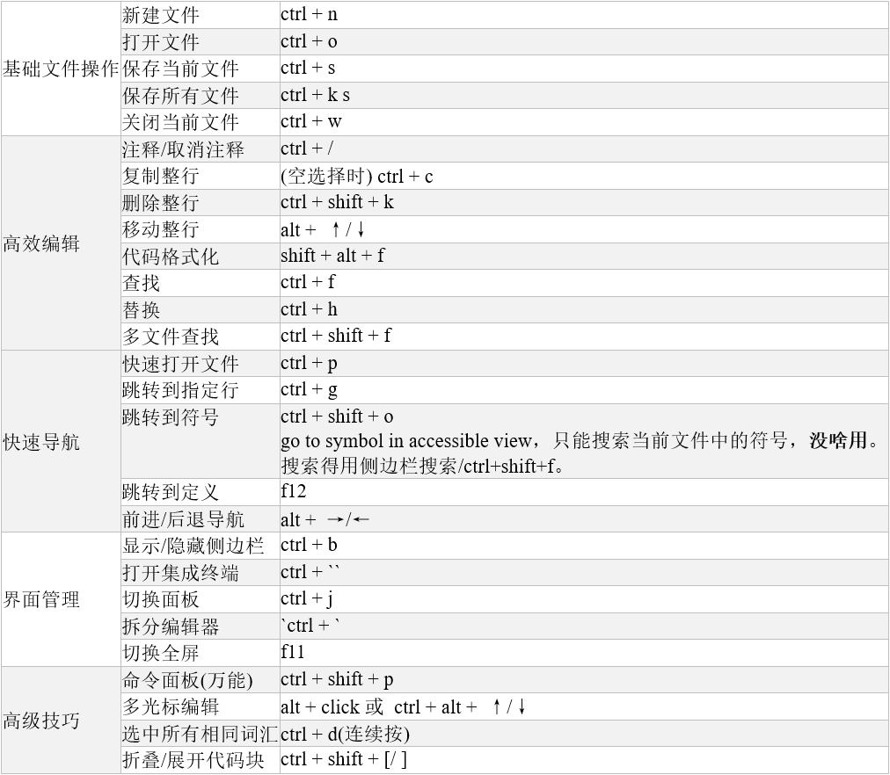

# 快捷键
ctrl + shift + p  : Show All Commands，或点左下角  
ctrl + p    : Go to File  
ctrl+k->t   : 切换主题theme  
ctrl+shift+v    :  markdown预览  

搜索函数和变量：  
ctrl+shift+f ：全局搜索，在整个工作区中搜索文本，包括函数和变量名。按f4跳转到下一个索引、shift+f4跳到上一个索引。按f4跳转到下一个索引、shift+f4跳到上一个索引。  
ctrl+f ：在当前文件中搜索。按f3跳到下一个搜索结果。  
ctrl+t ：符号搜索，在整个工作区中搜索符号(函数、变量、类等)。  
ctrl+shift+o ：文件内符号导航，列出当前文件中的所有符号并快速导航。  
f12 ：转到定义  
shift+f12 ：查找所有引用  

ctrl+h        : 替换  

ctrl+鼠标左键 : Go to Defination  
f12     : Go to Defination   
shift+f12   : Go to References  
ctrl+k -> f12 : 将编辑器分两栏，在右侧栏打开函数/宏/变量定义  
alt+o    : 在同名的C文件和h头文件之间切换，如果存在同名C文件和h头文件的话  
shift+alt+h  : Calls:Show Call Hierarchy，类似sourceinsight调用栈  

f5      : Start Debugging  
ctrl + `    : Toggle Terminal  

  


# theme主题

## 接近source insight 4.0的主题
此配置以VSCode浅色主题为基础，模拟Source Insight经典样式。可以根据实际观察的Source Insight界面颜色进行微调。  
更新：自定义配色配置成和最新的主题"VS Code Light"一样  
```
    //"workbench.colorTheme": "Visual Studio Light", // 建议先选择浅色主题作为基础
    //"chat.viewSessions.orientation": "stacked",
    //"editor.fontFamily": "Consolas, 'Courier New', monospace",
    //"editor.fontSize": 13,
    //"editor.lineHeight": 1.5,

    "workbench.colorCustomizations": {
        "[Visual Studio Light]": { // 此设置仅在"Visual Studio Light"主题下生效
            "foreground":"#202020",
            "titleBar.activeBackground": "#fafafd",
            "titleBar.border": "#f0f1f2",
            // 编辑区颜色设置
            "editor.background": "#ffffff",
            // 侧边栏按钮区颜色设置
            "activityBar.background": "#fafafd",
            "activityBar.foreground": "#3b3b3b",
            "activityBar.border": "#f0f1f2",
            // 侧边栏文件列表区颜色设置
            "sideBar.background": "#fafafd",
            "sideBar.foreground": "#373737",
            "sideBar.border": "#f0f1f2",
            // 状态栏：基本颜色设置
            "statusBar.background": "#fafafd",
            "statusBar.foreground": "#191818",
            "statusBar.border": "#f0f1f2",
            // 状态栏：特殊状态下的颜色
            "statusBar.noFolderBackground": "#f0f0f3",
            "statusBar.debuggingBackground": "#725102",
            // 状态栏：错误与警告颜色
            "statusBarItem.errorBackground": "#725102",
            "statusBarItem.warningBackground": "#725102",
            "editorLineNumber.foreground": "#6e7681", // 行号颜色
            //"editorGutter.background": "#FFF5F5"      // 行号区域背景色
        }
    },

    // 文本Mate规则配置，针对特定语法元素进行高亮设置
    "editor.tokenColorCustomizations": {
        "textMateRules": [ // 此设置在所有主题下生效
            {
                "scope": [
                    "entity.name.function", // 函数名
                    "meta.definition.method" // 类方法名
                ],
                "settings": {
                    "fontStyle": "bold" // 设置为加粗
                }
            }
        ],

        "[Visual Studio Light]": { // 同样指定在特定主题下生效
            "comments": "#444444",
            "keywords": "#008000",
            "strings": "#000000",
            "functions": "#01018b",
            "variables": "#000080",
            "types": "#008000",
            
            "textMateRules": [ // 更精细的语法作用域规则
                {
                    "scope": "entity.name.function",
                    "settings": {
                        "foreground": "#01018b",
                        "fontStyle": "bold"
                    }
                },
				{
					"scope": "entity.name.function.preprocessor", // 宏定义的作用域
					"settings": {
						"foreground": "#c50808" // 设置颜色，例如红色
					}
				},
                {
                    "scope": "constant.numeric",
                    "settings": {
                        "foreground": "#c50808"
                    }
                },
                {
                    "scope": "variable.parameter",
                    "settings": {
                        "foreground": "#000080"
                    }
                },
                {
                    "scope": "variable.other.local",
                    "settings": {
                        "foreground": "#000080"
                    }
                },
                {
                    "scope": "storage.modifier",
                    "settings": {
                        "foreground": "#4a7b4a"
                    }
                },
                {
                    "scope": "entity.name.type",
                    "settings": {
                        "foreground": "#008000"
                    }
                },
                {
                    "scope": [
                        "storage.type",
                        "keyword.control"
                    ],
                    "settings": {
                        "foreground": "#5151f7"
                    }
                }
            ]
        }
    },

    // 语义令牌高亮配置
    "editor.semanticTokenColorCustomizations": {
        // 此设置在所有主题下生效
        "enabled": true, // 确保启用语义高亮
        "rules": {
            "variable.global": { // 此规则专门针对全局变量
                "fontStyle": "bold"      // 可选：设置为粗体，使其更醒目
            }
        },

        "[Visual Studio Light]": { // 同样指定在特定主题下生效
            "enabled": true, // 确保启用语义高亮
            "rules": {
                "variable.global": { // 此规则专门针对全局变量
                    "foreground": "#000080", // 设置颜色，这里使用玫红色作为示例
                    "fontStyle": "bold"      // 可选：设置为粗体，使其更醒目
                },
                "macro": { // 此规则专门针对宏
                    "foreground": "#c50808" // 设置颜色，例如粉色
                },
                "enum": {           // 针对枚举类型名称
                    "foreground": "#c50808", // 设置颜色，例如蓝绿色
                    "fontStyle": "bold"        // 可选：设置为粗体
                },
                "enumMember": {     // 针对枚举成员
                    "foreground": "#c50808" // 设置颜色，例如深绿色
                }
            }
        }
    },
```

## 精简：只配置函数名、宏定义、全局变量 字体加粗
```
    "editor.tokenColorCustomizations": {
        "textMateRules": [ // 此设置在所有主题下生效
            {
                "scope": [
                    "entity.name.function", // 函数名
                    "meta.definition.method" // 类方法名
                ],
                "settings": {
                    "fontStyle": "bold" // 设置为加粗
                }
            }
        ]
    },

    // 语义令牌高亮配置
    "editor.semanticTokenColorCustomizations": {
        // 此设置在所有主题下生效
        "enabled": true, // 确保启用语义高亮
        "rules": {
            "variable.global": { // 此规则专门针对全局变量
                "fontStyle": "bold"      // 可选：设置为粗体，使其更醒目
            }
        }
    }
```

在VSCode中，可以通过 “开发者：检查编辑器令牌和范围” (Developer: Inspect Editor Tokens and Scopes)命令来查看。打开命令面板(Ctrl+Shift+P)，输入这个命令，然后将鼠标光标悬停在代码上，会弹出一个小窗口显示该处代码的准确作用域，这就是你配置textMateRules时需要的scope值。

