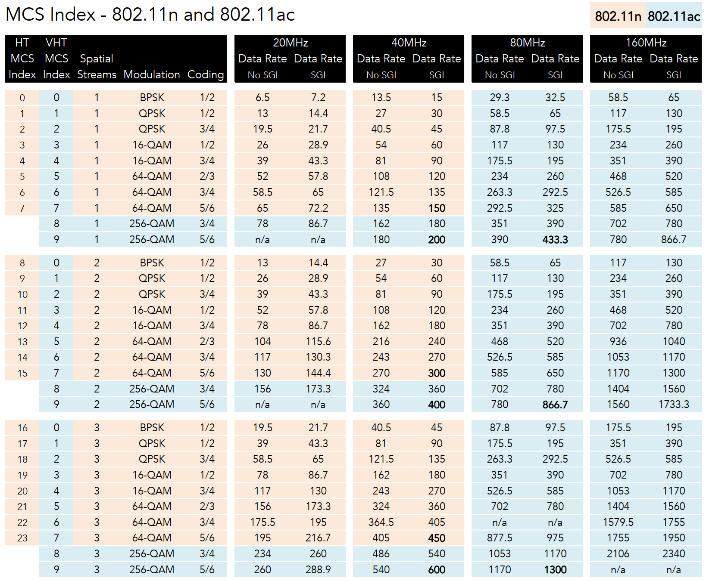
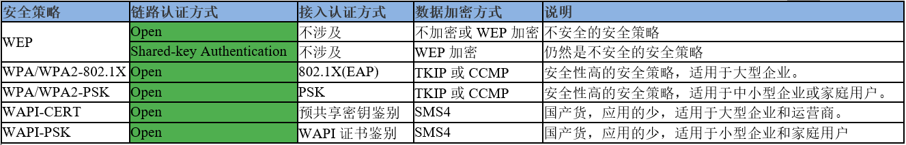
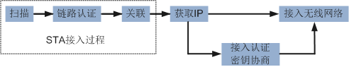
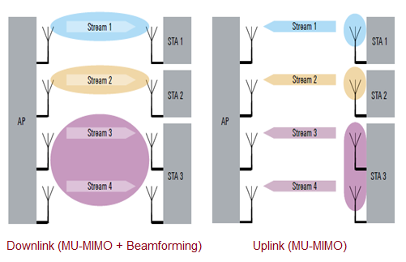

# wifi 802.11

## 速率表
[11abg速率](#11abg速率)  &emsp;&emsp;  [mcs index ( 11n & 11ac )](#mcs-index--11n--11ac-)  
### 11abg速率
| 标准            | 频率,带宽,非重叠信道    | 调制方式            | 数据传输速率(Mbps) -兼容性     | 传输距离(m)   |
| -------------- | -------------------- | ------------------ | --------------------------- | ----------- |
| 802.11,1997    | 2.4G,20MHz,3         | FHSS,DSSS          | 1,2                         | 20~100      |
| 802.11b,1999.9 | 2.4G,20MHz,3         | DSSS,CCK           | 1,2,5.5,11  -b              | 38~140      |
| 802.11a,1999.9 | 5G,20MHz,24          | OFDM               | 6,9,12,18,24,36,48,54  -a   | 35~120      |
| 802.11g,2003.6 | 2.4G,20MHz,3         | OFDM,DSSS,CCK      | 6,9,12,18,24,36,48,54  -b/g | 38~140      |
| 802.11n,2009.9 | 2.4G/5G,20/40MHz,15  | MIMO-OFDM,DSSS,CCK | 6.5,…,600  -a/b/g/n         | 70~250      |
| 802.11ac,2013  | 5G,20/40/80/160MHz,  | OFDM/DSSS          | 6.5,…,6928  -a/b/g/n/ac     | 38~140      |

速率与调制方式

| **Protocol**        | **Data rate (Mbit/s)** | **Modulation Method** |
| ------------------- | ---------------------- | --------------------- |
| 802.11b 802.11g  | 1                      | DSSS/DBPSK            |
| 802.11b 802.11g  | 2                      | DSSS/DQPSK            |
| 802.11b 802.11g  | 5.5, 11                | CCK/DQPSK             |
| 802.11g 802.11a  | 6, 9                   | OFDM/BPSK             |
| 802.11g 802.11a  | 12, 18                 | OFDM/QPSK             |
| 802.11g 802.11a  | 24, 36                 | OFDM/16-QAM           |
| 802.11g 802.11a  | 48, 54                 | OFDM/64-QAM           |

### mcs index ( 11n & 11ac )
  

## 认证和数据加密
如同下表中，列举出来几种安全策略所对应的链路认证、接入认证和数据加密的方式。  
  

这里再配合下面这张图一起理解下。**链路认证和接入认证是先后两个不同阶段的认证**。  
  
从表中可以看出，安全策略可分为WEP、WPA、WPA2和WAPI几种，这几种安全策略对应的链路认证其实只有Open和Shared-key Authentication两种，而802.1X和PSK则是属于接入认证方式。  

TODO：
https://blog.csdn.net/gueter/article/details/4812822

## 术语
### 天线与流
  
**M×N:n，M指发射天线的数目，N指接收天线的数目，n指空间流数目**。  
空间流？应该是指无线信号从发射端传输到接收端形成的一个空间通道，流是通道的意思。  
由此看来，流数应该是动态变化的，n应该是指最多支持的流数。** 有可能多条发送天线对应到一条流、或者多条接收天线对应到一条流？因此流数总是小于等于天线数（n小于等于M、N的最小值）**。  
在不同时刻流是不一样的，例如时刻t1空间存在一个从天线A1 -> B1的传输通道--记为流Stream1，同一时刻t1存在从天线A2 -> B3的传输通道--记为流Stream2，…；时刻t2空间存在一个从天线A1和天线A2 -> B4的传输通道--记为流Stream5，…  
Explanation of 2×2:2, 3×3:3 -- Lets take one of these apart to understand what each number represents. For instance 2x2:2, the first 2 represents TX (Sending Antenna), the second 2 represents Rx (Receiving Antenna), and the last 2 represents spatial streams in this means that it’s capable of handling two spatial streams.

## p2p
https://www.kancloud.cn/alex_wsc/android-wifi-nfc-gps/413031  
https://blog.csdn.net/wirelessdisplay/article/details/53365377  
https://blog.csdn.net/zerer110/article/details/78491456  
https://blog.csdn.net/andrewblog/article/details/17561179  
https://blog.csdn.net/lele_cheny/article/details/16354479  
https://blog.csdn.net/zjli321/article/details/51944887  
http://blog.ifjy.me/wifi/2016/05/15/p2p%E5%AD%A6%E4%B9%A0%E7%AC%94%E8%AE%B0.html#  
https://praneethwifi.in/  , TODO  

## 网址收藏
https://zhuanlan.zhihu.com/dot11

https://zhuanlan.zhihu.com/p/21623985

