# 工具与使用  
[omnipeek](#omnipeek)  &emsp;&emsp;  [wireshark](#wireshark)  &emsp;&emsp;  [iperf](#iperf)    


## omnipeek  

### 快捷键    
Ctrl \+ N ， Creates a new capture window.  
Ctrl \+ O ， Opens an Omnipeek capture file or other supported file type in a new capture file window.  
**Ctrl \+ S ， Opens the Save dialog to save all packets in the active window.**  
Alt \+ F4 ， Quits Omnipeek.  
Ctrl \+ E ， Opens the Select dialog, where you can use filters, ASCII or hex strings, packet length, and Analysis Modules to select captured packets.  
Ctrl \+ H ，Removes selected packets from the display without deleting them. Hidden packets are not processed further.  
Ctrl \+ Shift \+ H ，Removes unselected packets from the display without deleting them. Hidden packets are not processed further.  
**Ctrl \+ U ，Restores all previously hidden packets to normal status.**  
**Ctrl \+ G ，Opens the Go To dialog where you can choose a packet number to jump to. If packets are selected, the number of the first selected packet is shown.**  
Ctrl \+ F ，Finds patterns  
Ctrl \+ Tab ，Makes the next window in sequence the active window.  
Ctrl \+ Shift \+ Tab ，Makes the previous window in sequence the active window.  
**Ctrl \+ Y ，Start or Stop capture.**  
**Ctrl \+ B ，Deletes all packets from the active capture window.**  
**Ctrl \+ K ， Toggles automatic scrolling when a new item is added to the list.**  
Ctrl \+ Alt \+ Y ，Starts all local captures.  
Ctrl \+ Z Undoes the last edit.  
Ctrl \+ X Cuts the highlighted item(s) and copies to the clipboard.  
Ctrl \+ C Copies highlighted item(s) to the clipboard.  
Ctrl \+ V Pastes the current contents of the clipboard.  

备注：  
按住ctrl、鼠标左键选择一个或多个空口log，按**ctrl\+h**隐藏选择的log。  
按住shift、鼠标左键选择一个或多个空口log。  

**ctrl\+shift\+h**的作用和**ctrl\+h**相反，隐藏没有选择的log。  
按**ctrl\+u**取消隐藏。  

一些使用方法：  
1.右击弹出菜单框  
选中一个bit或字段，右击，弹出菜单框。  
①make filter，建立新的过滤器，不仅可以建立基于mac地址、ip地址的过滤器，而且可以建立基于一个bit或字段取值的过滤器。  
例如，beacon帧，建立一个基于dtim count=0的过滤器。  
鼠标指针放在dtim count，右击，弹出对话框，选择make filter…  
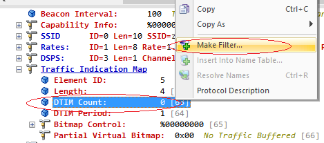    
弹出对话框如下，建立一个dtim count=0的过滤器。  
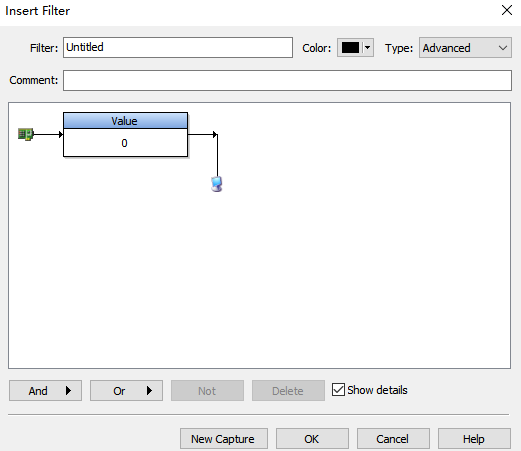    
双击过滤器，可以将value=0改为其他值，如下：  
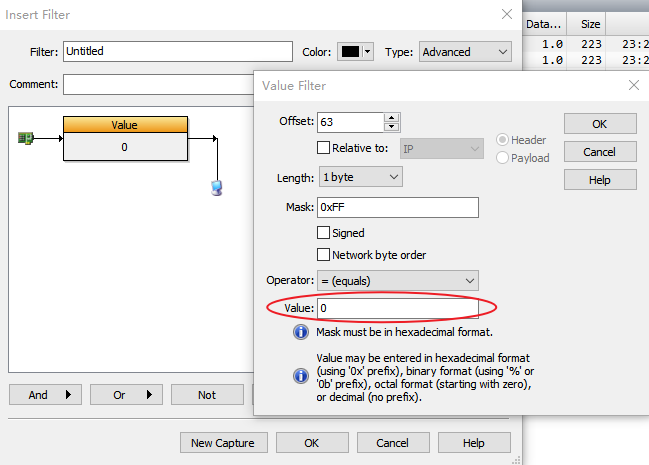    

②add as decode column，在显示窗口新增一个显示栏，解析指定bit或字段。  
例如显示窗口默认是没有dtim count这一列的，找到beacon帧，鼠标指针放在dtim count，右击，弹出对话框，选择add as decode column，这样就可以在显示窗口新增一个栏显示dtim count的值。同样的方法增加显示pvb的值。  
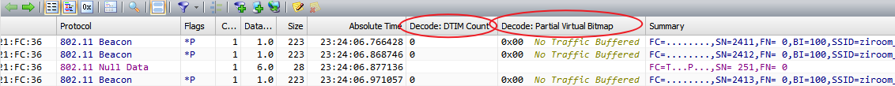    


### 过滤器
#### 新建过滤器
Omnipeek自带过滤器，如Beacon/Control/DATA/DHCP/ARP等。    
也可以建立自定义的过滤器，有simple/advanced两种方式。    
1.新建一个simple的filter，名字为test。Type默认为Simple，    
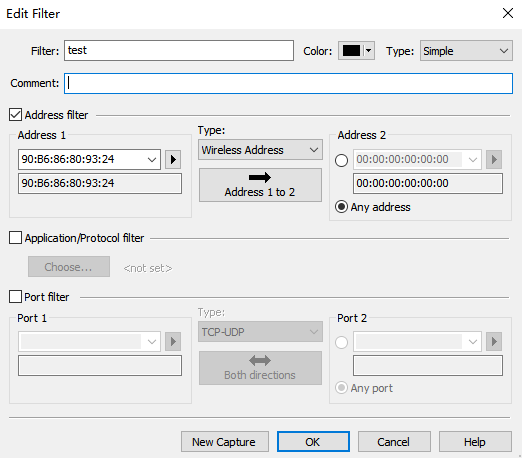    
2.新建一个advanced的filter，名字为test2。Type选择Advanced，    
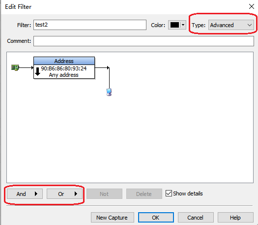    
点击And或Or，创建第二个过滤条件，弹出对话框如下：    
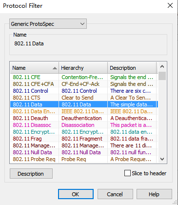    
得到如下过滤器，    
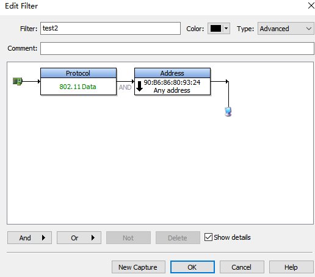    
还可以设置否定条件，点击第二个条件，再点击Not按钮，得到第二个条件的否定条件，    
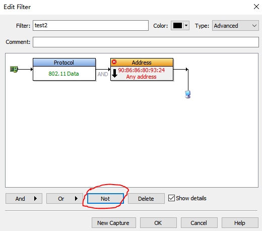    


#### 过滤器使用    
1.抓包的时候过滤    
抓包的时候选择某个过滤器，则只抓取符合过滤器条件的包；也可以不选择任何过滤器，则抓取空中的所有包。    
可以选择多个过滤器，只要满足其中一个过滤条件就抓包。  
下图选择了三个过滤器，过滤条件为Accept only packets matching at least one of 3 filters。  
    


2.显示的时候过滤    
显示的时候选择某一个过滤器，则只显示符合过滤器条件的包。    
    
选择一个自己建立的过滤器，例如之前建立的名字为test的过滤器。也可以选择Omnipeek自带的过滤器。    
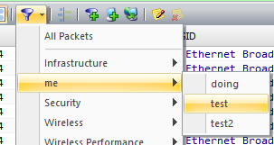    
注意，如果想切换过滤器，比如当前显示的是management类型包，现在想显示control类型包，则必须先在过滤器上选择All Packets（ctrl+u），之后再选择control过滤器。如果没有先在过滤器上选择All Packets这个步骤，则过滤出来的包为空，也就是说之后选择的过滤器是应用在先前已选过滤之上，是二次过滤。    


#### 过滤条    
过滤条，其实就是将之前使用鼠标点击选择过滤器的操作，转化为纯文本的操作。  
过滤条可以使用表达式，可以实现比过滤器更复杂的操作，可以对显示结果进行更精确的控制。  

**1.示例**  
filter('test')  
filter('doing')  
pspec('802.11 auth') \| pspec('802.11 deauth') \| pspec('802.11 assoc req') \| pspec('802.11 assoc rsp') \| pspec('802.11 reassoc req') \| pspec('802.11 reassoc rsp') \| pspec('802.11 disassoc') \| pspec('802.1x') \| pspec('dhcp') \| pspec('arp')  

可以使用\& \(And), \| \(Or), \! \(Not), \() \(Group)等运算符。  
语法：参考omnipeek软件说明文档：omnipeek_userguide.pdf -> Creating and Using Filters  -> Creating filters with the filter bar  


**2.filter()函数**  
omnipeek软件自带过滤器、自建过滤器。  

过滤条件：filter('test')是一个过滤表达式，filter()是过滤函数，test是已有的过滤器的名字，过滤器名字加单引号。  
过滤器名字大小写不敏感，filter('802.11 control')、filter('802.11 CONTROL')都是正确的；  
没有空格时可以不加单引号、有空格时必须加单引号，filter(udp)、filter('udp')、filter('802.11 control')正确，但filter(802.11 control)错误。  


**3.pspec()函数**  
常用过滤器名:  
802.11帧：  
802.11 control、802.11 data、802.11 management  
802.11 rts、802.11 cts、802.11 ack、802.11 ba、802.11 bar、802.11 ps-poll、……  
802.11 beacon、802.11 action、802.11 probe req、802.11 probe rsp、802.11 auth、802.11 deauth、802.11 assoc req、802.11 assoc rsp、802.11 reassoc req、802.11 reassoc rsp、802.11 disassoc、……  
802.11 null data、802.11 qos null data、802.11 qos data、802.11 a-msdu、802.11 frag、802.11 wep data、802.11 encrypted data、……  
注意：802.11 addba req、802.11 addba rsp不是pspec()过滤器名字。802.11帧的type、subtype帧类型的名字是pspec()过滤器名。比subtype更细的帧类型名字不是pspec()过滤器名字，802.11 addba req、802.11 addba rsp对应的pspec()过滤器名是802.11 action。  

802.1x帧，包括eapol四次握手帧：  
802.1x、EAP Request、EAP Response、EAP Success、EAP-Key、EAP-Start、EAP-Logoff、EAPOL EAP-Packet、EAPOL-Encapsulated-ASF-Alert。  

TCP/IP包：  
TCP、UDP、IP、HTTP、HTTPS、ICMP、ICMP Echo、ICMP Echo Reply、DNS、DHCP、ARP、ARP Request、ARP Response、IPv6、ICMPv6、ICMPv6 Echo Req、ICMPv6 Echo Reply、DHCPv6、……  

参考：[pspec()函数过滤器名](#pspec函数过滤器名)  


**4.length()函数**  
length(14) //过滤长度为14的帧，如ack、cts  
length(min: 128)  
length(max: 256)  
length(min:128,max:256)  


**5.wireless()函数**  
wireless(datarate:24) //过滤速率为24Mbps帧  
pspec('802.11 null data') & wireless(datarate:24) //过滤速率为24Mbps的null帧  

bssid过滤：  
wireless(bssid:90.B6.86.80.93.24)  


**6.addr()函数**  
mac地址过滤，  
addr(type:wireless,addr1:90.B6.86.80.93.24,addr2:40.45.DA.AA.99.FE) //**注意mac地址中间用点号,不能用冒号(语法冲突)**  
addr(type:wireless,addr1:'90:B6:86:80:93:24',addr2:40.45.DA.AA.99.FE) //**mac地址中间也也可以使用冒号，但必须外加单引号。**含有通配符也要外加单引号。  
addr(type:wireless,addr1:90B686809324,addr2:4045DAAA99FE) //**或者,直接写十六进制mac地址，中间不加任何符号**  
上述三种方式可以混合使用。  
addr(type:wireless,addr1:90.B6.86.80.93.24,addr2:40.45.DA.AA.99.FE,dir:1to2) //**还可以设定addr1-addr2之间的方向，1to2、2to1、both(默认)。备注:mac地址2to1不能用，软件bug，只能将addr2、addr1位置对调，仍然使用1to2**，如下：  
addr(type:wireless,addr1:40.45.DA.AA.99.FE,addr2:90.B6.86.80.93.24,dir:1to2)，  
或addr(type:wireless, addr2:90.B6.86.80.93.24, addr1:40.45.DA.AA.99.FE, dir:1to2) //addr1、addr2先后位置不重要。  

广播mac地址，  
addr(type:wireless,addr1:90.B6.86.80.93.24,addr2:ff.ff.ff.ff.ff.ff)   
addr(type:wireless,addr1:90B686809324,addr2:ffffffffffff)   

bssid过滤，  
wireless(bssid:90.B6.86.80.93.24)  
addr(type:wireless,addr1:90.B6.86.80.93.24,addr2:40.45.DA.AA.99.FE) & wireless(bssid:90.B6.86.80.93.24)  

ip地址过滤，  
addr(type: ip, addr1: 10.4.3.1, addr2: 10.5.1.1, dir: 1to2) //**ip地址过滤1to2、2to1、both都能使用**  
网址过滤，  
addr(ethernet:'3com:\*.\*.\*')  


**7.通配符**  
addr(type:wireless,addr1:'90.B6.86.80.93.\*',addr2:40.45.DA.AA.99.FE) //有通配符\*时需要加单引号，没有通配符时单引号可加可不加。  
addr(type:wireless,addr1:'90.B6.86.\*.\*.\*',addr2:40.45.DA.AA.99.FE)  
addr(type:wireless,addr1:'90.B6.\*.\*.\*.\*',addr2:40.45.DA.AA.99.FE)  

ip地址过滤：  
addr(ip:255.255.255.255)或者addr(ip:'255.255.255.\*') //有通配符\*时需要加单引号，没有通配符时单引号可加可不加。  
ip(255.255.255.255)或者ip('255.255.255.\*') //直接使用ip函数就可以  

**8.any地址怎么写？**  
addr(type:wireless,addr1:'D4:D2:D6:04:0B:\*')  
addr(type:wireless,addr1:'D4:D2:D6:04:0B:BD')  
addr(type:wireless,addr1:'D4:D2:D6:04:0B:\*',dir:1to2)  
**只写addr1、不写addr2，并且要加单引号'。**只写addr2、不写addr1不行。和过滤器的写法是一样的。  


#### 附
##### pspec()函数过滤器名
函数过滤器名.png)  


## wireshark  
### wireshark使用  
一、通用  
omnipeek、wireshark各有特点，Omnipeek界面好看，wireshark使用更灵活, wireshark显示phy&radio header（omnipeek没有）,两者结合着使用更好。  
wireshark显示phy&radio header，在有些情况下是很有用的。  
wireshark开源可以更新版本，支持最新11ax。omnipeek商业软件更新版本要付费。  

Wireshark、omnipeek可以相互打开对方的格式文件。  

菜单 -> 视图 -> 解析名称 -> 点击“解析物理地址”，取消显示时对物理地址的解析，如将全f的mac地址解析为广播地址。  


二、显示  
①显示窗口Column列的显示方式，右击列标题，可以单独设置每一列的左对齐居中右对齐显示方式。  
②新建显示列  
菜单 -> 编辑 -> 首选项 -> Appearance -> Columns，点击+号新建。  
a.新建一个wireshark自带的显示例，  
以新建绝对时间显示栏为例，点击+新建，标题输入想要在Columns栏里显示的文字，这里输单词Time，双击类型框、弹出类型选择下拉菜单，选择Absolute time，并且将已显示前面的复选框勾上。这样在抓包显示框里会多出一栏显示绝对时间。  
b.新建一个wireshark没有的显示例，  
以新建TA显示栏为例，点击+新建，标题输入想要在Columns栏里显示的文字，这里输单词TA，类型选择Custom（自定义），字段填入一个过滤器，这里填wlan.ta，并且将已显示前面的复选框勾上，点击OK。这样在抓包显示框里会多出一栏显示TA。  

③布局、列、字体和颜色  
菜单 \-> 编辑 \-> 首选项 \-> Appearance \-> Layout / Columns / Styles and Colors，可以对显示窗口“布局、列、字体和颜色”进行调整。  


三、右击弹出菜单使用  
wireshark选中一个bit或字段，右击，弹出菜单框：  
①应用为例\(ctrl+shift+i\) -- 在显示窗口添加一栏，并且显示每个包对应位/字段的值。例如显示窗口默认是没有sequence number这一列的，可以选中一个包，定位到sequence number字段，右击“应用为例”添加到显示栏中。  
②作为过滤器应用 -- 在过滤器框自动填写对应的过滤器，并且过滤对应的包。这样就不需要记住具体的过滤器名字和对应的值了。  
有多种过滤方式：选中/非选中/与选中/或选中/与非选中/或非选中。  
选中，只显示对应的包、不显示其他包；非选中，不显示对应的包、只显示其他包；与选中，和过滤器框里已有过滤器相与；或选中，……。  
删除过滤内容、按回车，或者点击过滤器栏后面的X符号，可以取消过滤、显示所有的包。  
③复制->作为过滤器，这样就生成对应的过滤语句并且复制到粘贴板了，可以去过滤条粘贴了。  
例如，想过滤HE_SU的帧，可以选中一个he格式的包，打开phy头(radiotap)，找到对应的字段，右击->复制->作为过滤器，就会生成对应的过滤语句到粘贴板：radiotap.he.data_1.ppdu_format == 0x0。  
作为过滤器应用，生成过滤语句，并且应用过滤语句，直接使过滤生效；复制->作为过滤器，只是生成过滤语句，不直接使过滤语句生效，可以将这个过滤语句粘贴到过滤条，与其他过滤语句混合使用。  
④用过滤器着色 -- 给对应的包着色。取消着色：菜单 -> 视图 -> 对话着色 -> 重置着色。  
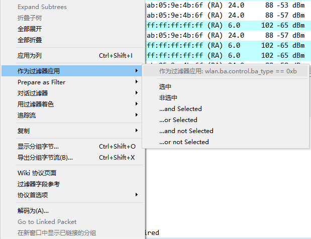  
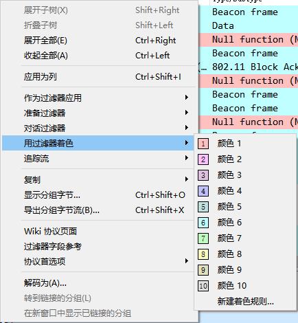  


### wireshark过滤  
参考：https://aiknowledge.cn/collection/645-wireshark#  

#### 自定义过滤器  
1.点击过滤器工具栏后面的+，新建一个过滤器。  
例如，新建association request帧过滤器，标签填assoc req，过滤器填wlan.fc.type_subtype == 0x00，注释填:关联请求。  
注释可写可不写。  
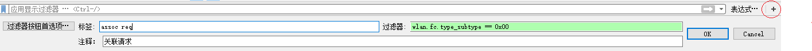  

2.过滤器管理，新建/删除/启用/禁用过滤器  
点击过滤器工具栏后面的+，点击“过滤器按钮首选项”，打开过滤器管理框。  
或者，菜单 -> 编辑 -> 首选项 -> Filter Buttons，也可以打开过滤器管理框。  
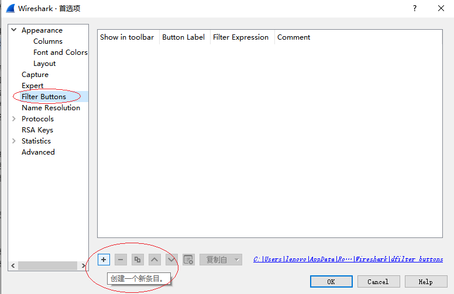  
点击+号，创建一个新条目。  
例如，新建一个过滤器名称\(Button Label\)为beacon，过滤表达式\(Filter Expression\)为wlan.fc.type_subtype == 0x08，Comment栏添加注释、也可不添加。  
最后，将Show in toolbar栏下的选择框勾上。如下：  
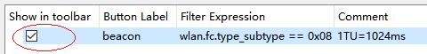  
这样，在过滤器栏的后面就会显示对应的过滤器名的按钮了。点击这个按钮就可以应用过滤器。  
  


#### 802.11帧类型过滤  
Wireshark Display Filters related **management** traffic:  

| wlan.fc.type == 0          | all management frames        |
| --------------             | --------------------         |
| wlan.fc.type_subtype == 0  | association requests         |
| wlan.fc.type_subtype == 1  | association response         |
| wlan.fc.type_subtype == 2  | re-association request       |
| wlan.fc.type_subtype == 3  | re-association response      |
| wlan.fc.type_subtype == 4  | probe requests               |
| wlan.fc.type_subtype == 5  | probe responses              |
| wlan.fc.type_subtype == 8  | beacons                      |
| wlan.fc.type_subtype == 9  | atims                        |
| wlan.fc.type_subtype == 10 | disassosiations              |
| wlan.fc.type_subtype == 11 | authentications              |
| wlan.fc.type_subtype == 12 | deauthentications            |
| wlan.fc.type_subtype == 13 | actions                      |

Wireshark Display Filters related **Control** frames traffic:  

| wlan.fc.type == 1          | all control frames           |
| --------------             | --------------------         |
| wlan.fc.type_subtype == 24 | block ack requests           |
| wlan.fc.type_subtype == 25 | block ack                    |
| wlan.fc.type_subtype == 26 | ps-polls                     |
| wlan.fc.type_subtype == 27 | rts                          |
| wlan.fc.type_subtype == 28 | cts                          |
| wlan.fc.type_subtype == 29 | acks                         |
| wlan.fc.type_subtype == 30 | cf-ends                      |
| wlan.fc.type_subtype == 31 | cf-ends/cf-acks              |

Wireshark Display Filters related **Data** frames traffic:  

| wlan.fc.type == 2          | all data frames              |
| --------------             | --------------------         |
| wlan.fc.type_subtype == 32 | data frames                  |
| wlan.fc.type_subtype == 33 | data+cf-ack                  |
| wlan.fc.type_subtype == 34 | data+cf-poll                 |
| wlan.fc.type_subtype == 35 | data+cf-ack + cf-ack         |
| wlan.fc.type_subtype == 36 | null data                    |
| wlan.fc.type_subtype == 37 | cf-ack                       |
| wlan.fc.type_subtype == 38 | cf-poll                      |
| wlan.fc.type_subtype == 39 | cf-ack + cf-poll             |
| wlan.fc.type_subtype == 40 | qos data                     |
| wlan.fc.type_subtype == 41 | qos data + cf-ack            |
| wlan.fc.type_subtype == 42 | qos data + cf-poll           |
| wlan.fc.type_subtype == 43 | qos data + cf-ack+ cf-poll   |
| wlan.fc.type_subtype == 44 | qos null                     |
| wlan.fc.type_subtype == 46 | qos cf-poll                  |
| wlan.fc.type_subtype == 47 | qos cf-ack + cf-poll         |

Wireshark Display Filters related **Retries**:  

| wlan.fc.retry ==1          | retry frames                               |
| --------------             | --------------------                       |
| wlan.fc.retry ==1 && wlan.fc.tods ==1   | towards ap                    |
| wlan.fc.retry ==1 && wlan.fc.fromds ==1 | from ap towards client device |

Wireshark Display Filters related **802.11 k,v,r** traffic:  

| wlan.fixed.action_code ==23 | 802.11v dms request                                    |
| --------------              | --------------------                                   |
| wlan.fixed.action_code ==24 | 802.11v dms respose                                    |
| wlan.rm.action_code ==4     | 802.11k neighbour request                              |
| wlan.rm.action_code ==5     | 802.11k neighbour response                             |
| (wlan.fc.type_subtype\=\=0)&&(wlan.rsn.akms.type\=\=3) | 802.11r auth request            |
| (wlan.fc.type_subtype\=\=1)&&(wlan.tag.number\=\=55)   | 802.11r auth response           |
| (wlan.fc.type_subtype\=\=2)&&(wlan.tag.number\=\=55)   | 802.11r re-association request  |
| (wlan.fc.type_subtype\=\=3)&&(wlan.tag.number\=\=55)   | 802.11r re-association response |

Wireshark Display Filters related **Weak signals**:  

| wlan_radio.signal_dbm < -67 | weak signal filter                                 |
| --------------              | --------------------                               |
| wlan.fc.type_subtype == 0x05 && wlan_radio.signal_dbm < -75 | weak prob response |
| wlan.fc.type_subtype == 0x04 && wlan_radio.signal_dbm < -75 | weak prob requests |

Some **Extras**:  

| wlan.addr == mac address     | specific client by mac address |
| --------------               | --------------------           |
| wlan.ta == mac address       | transmitter address            |
| wlan.ra == mac address       | receive address                |
| wlan.sa == mac address       | source address                 |
| wlan.da == mac address       | destination address            |
| wlan.bssid == ap mac address | radio mac address              |
| wlan.mgt.ssid == “your-ssid” | filter by ssid                 |

Some **Extras 2**:  

| wlan.fc.type_subtype == 14 | Action No Ack                   |
| --------------             | --------------------            |
| wlan.fc.type_subtype == 15 | Aruba Management                |
| wlan.fc.type_subtype == 16 | Unrecognized (Reserved frame)   |
| wlan.fc.type_subtype == 17 | Unrecognized (Reserved frame)   |
| wlan.fc.type_subtype == 18 | Trigger                         |
| wlan.fc.type_subtype == 19 | Unrecognized (Reserved frame)   |
| wlan.fc.type_subtype == 20 | Beamforming Report Poll         |
| wlan.fc.type_subtype == 21 | VHT/HE NDP Announcement         |
| wlan.fc.type_subtype == 23 | Control Wrapper                 |
| wlan.fc.type_subtype == 24 | 802.11 Block Ack Req            |
| wlan.fc.type_subtype == 25 | 802.11 Block Ack                |
| wlan.fc.type_subtype == 26 | Power-Save poll                 |
| wlan.fc.type_subtype == 27 | Request-to-send                 |
| wlan.fc.type_subtype == 28 | Cear-to-send                    |
| wlan.fc.type_subtype == 29 | Acknowledgement                 |
| wlan.fc.type_subtype == 30 | CF-End (Control-frame)          |
| wlan.fc.type_subtype == 31 | CF-End + CF-Ack (Control-frame) |
| wlan.fc.type_subtype == 32 | Data                            |
| wlan.fc.type_subtype == 33 | Data + CT-Ack                   |

from : https://www.wifi-professionals.com/2019/03/wireshark-display-filters  


#### 802.11帧过滤  
`wlan.sa == 00:1a:2b:3c:4d:5e`     //只看该客户端发出的帧  
`wlan.da == 00:1a:2b:3c:4d:5e`     //只看发给该客户端的帧  
`wlan.sa == 00:1a:2b:3c:4d:5e  ||  wlan.da == 00:1a:2b:3c:4d:5e`  //某个客户端的所有帧（作为 SA 或 DA）  
`wlan.addr == 00:1a:2b:3c:4d:5e`   //更简洁：用 wlan.addr 替代  
`wlan.bssid == aa:bb:cc:dd:ee:ff`   //按 AP 的 BSSID 过滤（所有关联该 AP 的通信）  
`wlan.fc.type_subtype == 4  &&  wlan.sa == 00:1a:2b:3c:4d:5e`     //过滤探测请求（Probe Request）  
`wlan.fc.type_subtype == 8  &&  wlan.bssid == aa:bb:cc:dd:ee:ff`  //过滤 Beacon 帧（AP 定期广播）  
`(wlan.fc.type == 0) && (wlan.fc.subtype in {0 1 2 3 4 5 6 7 8 9 10 11 12 13 14 15})`   //过滤关联/认证帧  
`!(wlan.da == ff:ff:ff:ff:ff:ff) && !(wlan.da[0:1] == 01)`           //排除广播/组播  
`(wlan.sa == A && wlan.da == B) || (wlan.sa == B && wlan.da == A)`   //查看两个设备之间的直接通信（Ad-hoc 或 TDLS）  
`radiotap.dbm_antsignal > -70 && wlan.sa == 00:1a:2b:3c:4d:5e`       //结合 RSSI（信号强度，需 radiotap 头部）  

`wlan.da == ff:ff:ff:ff:ff:ff`  //广播  
`wlan.da[0:1] & 0x01 == 0x01`   //组播（包括广播）  

数据帧：  
`wlan.fc.type == 2 && wlan.sa == 00:1a:2b:3c:4d:5e`          //某STA发出  
`wlan.fc.type == 2 && wlan.da == 00:1a:2b:3c:4d:5e`          //发往某STA  
`wlan.fc.type == 2 && wlan.addr == 00:1a:2b:3c:4d:5e`        //源或目的任一  
`wlan.fc.type == 2 && wlan.ta == aa:bb:cc:dd:ee:ff`          //物理发射方（AP）  
`wlan.fc.type == 2 && wlan.ra == 00:1a:2b:3c:4d:5e`          //物理接收方  
`wlan.fc.type == 2 && wlan.bssid == aa:bb:cc:dd:ee:ff`       //某AP下所有11ax数据  
`wlan.fc.type == 2 && wlan.bssid == aa:bb:cc:dd:ee:ff && wlan.sa == 00:1a:2b:3c:4d:5e`  

`wlan.fc.type == 2 && wlan.fc.retry == 1`       //重传  
`wlan.fc.type == 2 && !(wlan.fc.retry == 1)`    //首传（非重传）  
`wlan.fc.type == 2 && wlan_radio.phy == 11 && wlan.fc.retry == 1`   //11ax重传   
`wlan.fc.type == 2 && radiotap.he.data_3.data_mcs <= 2`    //低MCS  
`wlan.fc.type == 2 && radiotap.dbm_antsignal < -75`        //弱信号数据   
`wlan.fc.type == 2 && wlan.bssid == AP && wlan.fc.protected == 1`        //加密11ax数据  
`wlan.fc.type == 2 && wlan.fc.protected == 0 && wlan.bssid == AP`        //未加密11ax数据（排查明文）  
`wlan.fc.type == 2 && wlan.fc.type_subtype == 0x28 && wlan.qos.tid == 6` //QoS数据+TID6语音   


按 OUI 过滤（前3字节）  
`wlan.sa[0:3] == 00:0c:29`    //VMware 虚拟网卡  
`wlan.bssid[0:3] == 00:1a:2b`  
`wlan.addr[0:3] == 00:50:56`  

场景：  
`wlan.addr == 手机MAC`    //跟踪某个手机的所有行为  
`wlan.bssid == AP_MAC`    //只看某个 AP 下所有通信  
`wlan.fc.type_subtype == 4`  //看谁在扫描网络（Probe Req）  
`wlan.fc.type_subtype == 8 && wlan.bssid == AP_MAC`  //看某个 AP 的 Beacon 间隔    
`wlan.fc.type_subtype == 12（Deauthentication）`     //排查 Deauth 攻击  
`radiotap.dbm_antsignal < -75 && wlan.fc.type == 2`  //看弱信号客户端（数据帧）  
`!(wlan.addr == 本机监控接口MAC)`  //排除本机（监控模式网卡自身）  


#### 以太网过滤  
一、显示过滤器（主用）  
基础字段：  
`eth.addr`  //源或目的任一匹配  
`eth.src`   //源 MAC  
`eth.dst`   //目的 MAC  
`eth.addr_resolved / eth.src_resolved / eth.dst_resolved`  //带厂商名解析后的显示值  
`eth.type`       //以太网类型，如 0x0800=IPv4、0x0806=ARP、0x86dd=IPv6  
`eth.dst.ig`     //组播/广播位，1=组地址；eth.src.ig 同理  
`eth.src.oui / eth.dst.oui / eth.addr.oui` //前3字节 OUI（整数）；*.oui_resolved 是厂商字符串  
`eth.addr == 00:1a:2b:3c:4d:5e`        // 源或目的是该MAC  
`eth.src == 00:1a:2b:3c:4d:5e`         // 仅该MAC发出  
`eth.dst == 00:1a:2b:3c:4d:5e`         // 仅发往该MAC  
`eth.addr == 00-1a-2b-3c-4d-5e`        // 连字符也行  
`eth.addr == 001a.2b3c.4d5e`           // 点分组也行  
MAC格式支持 :、-、点分组三种，Wireshark 显示过滤都认。    
1) 排除某个 MAC  
`eth.addr` 是“源或目的”复合字段，排除要用**整体取反**，**别用 !=**：  
`!(eth.addr == 00:1a:2b:3c:4d:5e)`     //正确：完全排除该MAC收发  
`eth.addr != 00:1a:2b:3c:4d:5e`        //不推荐：易把“另一头不是它”的包也放进来  
2) 按厂商 OUI / 前3字节    
`eth.src[0:3] == 00:06:5b`             //源MAC前3字节（DELL示例）  
`eth.dst[0:3] == 00:0c:29`             //VMware  
`eth.addr[0:3] == 00:50:56`            //源或目的前3字节命中即可  
`eth.src.oui == 0x000c29`              //等价整数写法（部分版本）  
`eth.src.oui_resolved contains "Cisco"`    
切片语法`[偏移:长度]`，MAC 偏移从0开始；只写 `eth.src[0]` 会按提供的字节串长度推断，给3字节就比前3字节。    
3) 广播 / 组播  
`eth.dst == ff:ff:ff:ff:ff:ff`         //以太网广播  
`eth.dst.ig == 1`                      //所有组播/广播目的（IG位=1）  
`eth.dst[0:1] == 01`                   //目的MAC首字节01，粗筛组播  
`eth.dst[0:3] == 01:00:5e`             //IPv4组播（01:00:5e:*)  
`eth.dst[0:2] == 33:33`                //IPv6组播（33:33:*)  
`!(eth.dst == ff:ff:ff:ff:ff:ff) && eth.dst.ig == 1`   //只要组播不要全F广播  
4) 结合协议/端口    
`eth.src == 00:1a:2b:3c:4d:5e && ip`  
`eth.src == 00:1a:2b:3c:4d:5e && tcp.port == 443`  
`eth.dst == 00:1a:2b:3c:4d:5e && arp`  
`eth.addr == 00:1a:2b:3c:4d:5e && (tcp || udp)`  
`eth.type == 0x0806`                   //只留ARP（不看MAC也行）  
`eth.type == 0x0800 && eth.src == 00:1a:2b:3c:4d:5e`  
5) ARP 里的 MAC  
ARP 请求/响应自带发送端、目标端硬件地址，可单独筛：  
`arp.src.hw_mac == 00:1a:2b:3c:4d:5e`   //ARP发送端MAC  
`arp.dst.hw_mac == 00:1a:2b:3c:4d:5e`   //ARP目标MAC（通常全F）  
`arp && eth.src == 00:1a:2b:3c:4d:5e`   //该MAC发出的所有ARP  
6) VLAN / 多层 MAC    
`vlan && eth.addr == 00:1a:2b:3c:4d:5e`  
`vlan.id == 100 && eth.dst == 00:1a:2b:3c:4d:5e`  
抓带 VLAN 标签的包时，显示过滤加 vlan 更稳；捕获过滤器用 vlan 关键字另行处理。    
二、捕获过滤器（BPF，抓包前填）  
`ether host 00:1a:2b:3c:4d:5e`      //源或目的该MAC  
`ether src 00:1a:2b:3c:4d:5e`       //仅源  
`ether dst 00:1a:2b:3c:4d:5e`       //仅目的  
`not ether host 00:1a:2b:3c:4d:5e`  //排除该MAC  
`ether broadcast`                   //广播  
`ether multicast`                   //组播  
`ether proto 0x0806`                //仅ARP  
`ether proto 0x0800`                //仅IPv4  
`ether src 00:0c:29:*`              //多数BPF不支持通配，按完整MAC写；部分前端可简化  
组合示例：    
`ether host 00:1a:2b:3c:4d:5e and tcp port 443`  
`ether src 00:1a:2b:3c:4d:5e and icmp`  
`ether dst 01:00:5e:00:00:01`  
`not ether broadcast and not ether multicast`  
捕获过滤器不支持 `eth.addr==`、不支持 OUI 切片通配；要“前3字节”只能在显示过滤用 `eth.src[0:3]`，或在 BPF 用裸偏移（如 `ether[0:3]=0x000c29` 一类，写法更绕，一般不推荐）。  


#### TCP/IP过滤  
`ip.addr == 192.168.1.100`           //源或目的任一是该IP  
`ip.src == 10.0.0.1`  
`ip.dst == 8.8.8.8`  
`ip.src == 192.168.1.0/24`  
`ipv6.addr == 2001:db8::1`  
`eth.addr == 00:1a:2b:cc:dd:ee`  
`eth.src == 00:1a:2b:cc:dd:ee`  

`tcp.port == 443`                    //源或目的443  
`tcp.srcport == 80`  
`tcp.dstport == 443`  
`udp.port == 53`  
`tcp.port >= 8000 && tcp.port <= 8100`  

`frame.len > 1000`                   //包长  
`frame.time_relative > 60`           //抓包开始60秒后  
`frame.time_delta > 0.5`             //与前一包间隔>0.5s  

复合字段 `ip.addr/tcp.port/eth.addr` 配 `!=` 有坑：  
`ip.addr != 10.0.0.5` 等价于“源不等于它 或 目的不等于它”，几乎恒真。排除某IP应写：`!(ip.addr == 10.0.0.5)`  


**arp**  
`arp.src.hw_mac == 00:1a:2b:3c:4d:5e`   //ARP发送端MAC  
`arp.dst.hw_mac == 00:1a:2b:3c:4d:5e`   //ARP目标MAC（通常全F）  
`arp && eth.src == 00:1a:2b:3c:4d:5e`   //该MAC发出的所有ARP  

**DNS**:  
`dns`  
`dns.qry.name == "example.com"`  
`dns.qry.name contains "example"`  
`dns.qry.type == 1`                  //A记录  
`dns.flags.response == 0`            //查询  
`dns.flags.response == 1`            //响应  
`dns.flags.rcode == 0`               //无错误  
`dns.flags.rcode == 3`               //NXDOMAIN  
`dns.a == 1.2.3.4`                   //解析到某IP  

**icmp**    
`icmp.type == 0`                     //echo reply  
`icmp.type == 8`                     //echo request  
`icmp.type == 3`                     //目标不可达  

**dhcp**    
`dhcp or dhcpv6`  

**others**  
`ftp or telnet`                      //明文协议重点看  
`smb or smb2`  
`ssh`  


**字符串、正则、字节切片、按层**  
`http.request.uri contains "/login"`  
`tcp contains "admin"`                  //任意TCP载荷包含admin  
`udp contains 81:60:03`                 //UDP头/载荷包含该字节序列  
`http.request.uri matches "gl=se$"`  
`sip.To contains "a1762"`  
`dns.qry.name matches "\\.google\\.com$"`  

**字节切片：从某协议偏移取N字节**  
`udp[8:3] == 81:60:03`              //UDP载荷偏移8字节起3字节  
`eth.src[0:3] == 00:06:5b`          //按OUI过滤厂商  
`tcp[0:2] == 0x1500`                //示例：TCP头前2字节  

**多层层叠（GRE/VXLAN/隧道）指定第几层**  
`ip.src#1 == 10.1.2.3`              //外层源IP  
`ip.src#2 == 10.1.2.3`              //内层源IP  

**集合成员**  
`tcp.port in {443 8443}`  
`ip.addr in {10.0.0.5 .. 10.0.0.9}`  
`tcp.port in {4430..4434}`  


#### wireshark过滤语法  
`比较：== eq、!= ne、> gt、< lt、>= ge、<= le（英文/C风格可混用）。`  
`逻辑：and &&、or ||、not !、括号改变优先级。`  
`字符串匹配：contains（包含子串）、matches（PCRE 正则，默认不区分大小写）、startswith、endswith。`  
`存在判断：直接写协议/字段名即“存在”，如 http、tcp.flags.syn。`  


参考：  
https://aiknowledge.cn/collection/645-wireshark#  
https://blog.csdn.net/ffggnfgf/article/details/51056018  
http://www.csna.cn/viewthread.php?tid=14614  


#### 蓝牙包过滤
只显示特定设备的广播包  
`btle.advertising_address == aa:bb:cc:dd:ee:ff`  
 
只显示包含特定服务的广播  
`btle.advertising_data.service_uuid16 == 0x180D`  
 
排除空数据包  
`btle.length != 0`  

组合过滤条件  
`btle.advertising_address == aa:bb:cc:dd:ee:ff && btle.advertising_data.service_uuid16 == 0x180D`  

只显示加密后的ATT数据包  
`btatt && btle.encrypted == 1`   
 
显示特定特征的通知  
`btatt.opcode == 0x1b && btatt.handle == 0x000e`  
 
显示写入操作  
`btatt.opcode == 0x12`  


### wireshark怎么抓包  
**设置捕获接口**  
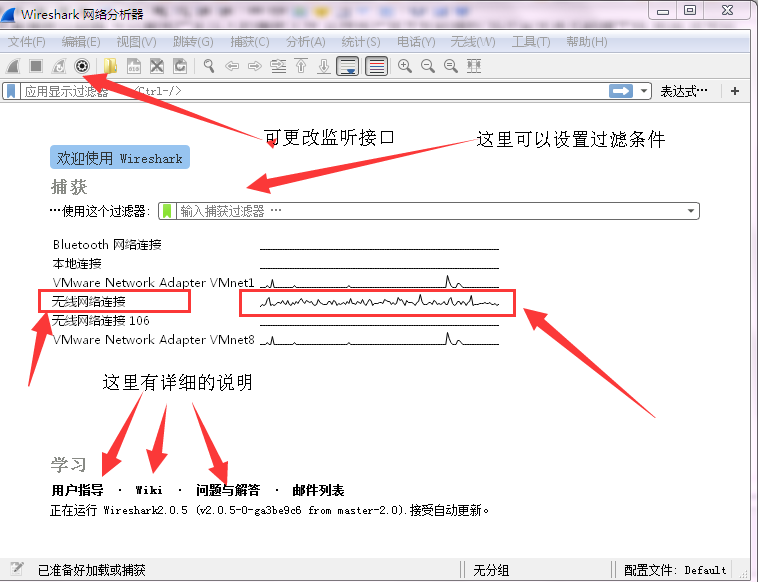  
**停止与重新监听**  
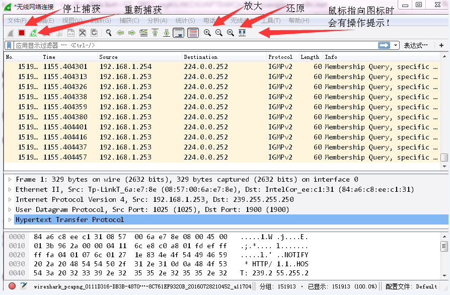  
**数据包的保存**  
完成数据包的捕获后，可能我们并不急着马上做分析，或者说当前能做的分析还不够完整，需要后面来加深……如此种种，我们需要用文件保存这些数据包。保存数据包也有三种方式，  
1 使用Ctrl+S组合键；  
2 菜单栏：依次点击"File"-->"Save"  
3 主工具栏 的按钮  
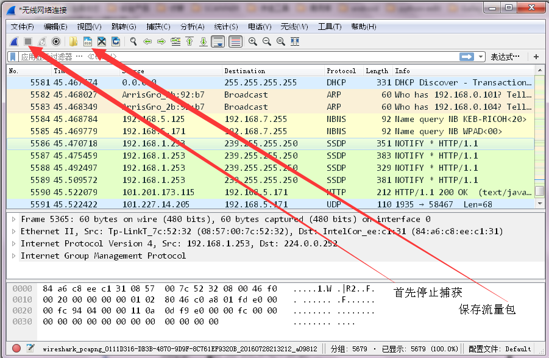  
原文：https://blog.csdn.net/u013258415/article/details/77877746  


### wireshark常用选项与功能总结  
参考：https://blog.csdn.net/lhorse003/article/details/71758019  


## tcpdump  

### 基础  
\$ tcpdump \//不加任何参数，默认情况下将抓取第一个非lo网卡上所有的数据包  
\$ tcpdump \-D \//命令查看哪些接口可用于捕获  
\$ tcpdump \-i eth0 \//选择接口\(网卡\)。tcpdump \-i any抓所有接口  
\$ tcpdump \-i eth0 \-w test.pcap \//保存到文件。有的系统抓包过程中查看文件大小为0，需要将tcpdump进程杀掉，才会才会将抓包写到文件。  
\$ tcpdump \-i eth0 icmp  
\$ tcpdump \-e \-i eth0 \//显示链路层  
\$ tcpdump \-X   \//显示16进制和ASCII  
\$ tcpdump \-XX  \//和\-X一样,同时显示链路层头\(ethernet header\)  
\$ tcpdump \-c 20  \//抓20个包后停止  


### 组合条件  
tcpdump -i eth0 icmp and host 192.168.0.183 and 192.168.0.17 //两个ip之间  
tcpdump -i eth0 icmp and host 192.168.0.183 or 192.168.0.17  //包含其中一个ip即可  
tcpdump -i eth0 icmp and host 192.168.0.183 and \( 192.168.0.17 or 192.168.0.148 \)  
tcpdump -i eth0 icmp or arp or \(udp and \(port 67 or port 68\)\) //icmp、arp、dhcp。注: dhcp使用67和68端口   
tcpdump -i eth0 'icmp or arp or (udp and (port 67 or port 68))' //加单引号，比\(\)转义看起来整洁  
tcpdump -e -i eth0 'icmp or arp or \(udp and \(port 67 or port 68\)\)' //-e显示链路层头部信息  
tcpdump -e -i eth0 'icmp or arp or \(udp and \(port 67 or port 68\)\) and \(host 192.168.0.183 and host 192.168.0.17\)' //两个ip之间  
tcpdump -e -i eth0 'icmp or arp or \(udp and \(port 67 or port 68\)\) and \(host 192.168.0.183 or host 192.168.0.17\)' //包含其中一个ip即可  
tcpdump dst 192.168.0.2 and not icmp //not前面一定要有and吗？是的  

ip icmp arp rarp 和 tcp、udp、icmp这些选项等都要放到第一个参数的位置，用来过滤数据报的类型。  
否定操作符的优先级别最高，与操作和或操作优先级别相同，并且二者的结合顺序是从左到右。和C语言是一样的吗？  
要注意的是，表达'与操作'时，需要显式写出'and'操作符，而不只是把前后表达元并列放置。  


## iperf  
### iperf介绍
**iperf官网**  
iperf下载：https://iperf.fr/    
iperf不需要安装，当需要用iperf来测试网络中两个结点间的带宽时，只需把iperf.exe文件分别copy到这两台计算机的硬盘中。使用时，直接在命令行窗口中运行带各种参数的iperf命令即可。    

**iperf介绍**  
iperf是一个网络性能测试工具，它拥有多个参数，可以测量TCP和UDP的带宽，延时抖动以及丢包率。    
带宽测试通常采用UDP模式，因为能测出极限带宽、时延抖动、丢包率。在进行测试时，首先以链路理论带宽作为数据发送速率进行测试，例如，从客户端到服务器之间的链路的理论带宽为100Mbps，先用-b 100M进行测试，然后根据测试结果（包括实际带宽，时延抖动和丢包率），再以实际带宽作为数据发送速率进行测试，会发现时延抖动和丢包率比第一次好很多，重复测试几次，就能得出稳定的实际带宽。    


### iperf使用
**TCP模式**    
服务器端：iperf -s    
客户端：iperf -c 192.168.1.1 -t 60  //在tcp模式下，客户端到服务器192.168.1.1上传带宽测试，测试时间为60秒。    
iperf -c 192.168.1.1 -P 30 -t 60  //客户端同时向服务器端发起30个连接线程。    
iperf -c 192.168.1.1 -d -t 60  //进行上下行带宽测试。  

**UDP模式**    
服务器端：iperf -u -s  
客户端：iperf -u -c 192.168.1.1 -b 100M -t 60  //在udp模式下，以100Mbps为数据发送速率，客户端到服务器192.168.1.1上传带宽测试，测试时间为60秒。    
iperf -u -c 192.168.1.1 -b 5M -P 30 -t 60  //客户端同时向服务器端发起30个连接线程，以5Mbps为数据发送速率。    
iperf -u -c 192.168.1.1 -b 100M -d -t 60  //以100M为数据发送速率，进行上下行带宽测试。  


**iperf和iperf3**  
iperf  
server端：iperf -s -p 25001 -B 192.168.33.103 (-u)  
client端： iperf -c 192.168.33.103 -p 25001 -B 192.168.33.104 -4 -f K -n 10M -b 10M (-u) //-4 指定ipv4  

iperf3  
server端：iperf3 -s -p 25001 -B 192.168.33.103  
client端： iperf3 -c 192.168.33.103 -p 25001 -B 192.168.33.104 -4 -f K -n 10M -b 10M --get-server-output (-u)  

iperf与iperf3的区别  
iperf3的server端不支持“-u”参数，默认可以测试tcp和udp；  
iperf3不支持双工模式测试。  


**传文件**  
服务端：iperf -s -u  
客户端：iperf -c 192.168.100.1 -i 1 -u -t 60 -F /root/a.zip -P 5  


**iperf是client端向server端发送数据。**  
server端显示的是接收速率，最好加i参数，进行速率跟踪。  
client 显示的是发送速率。  

上行、下行  
从客户端向服务器端发送数据，对于客户端来说是上行，对于服务器端来说是下行。  
对于某个设备，如果想要测试设备的上行速率，那么设备应该作为客户端，使用iperf -c；  
测试设备的下行速率，那么设备应该作为服务器端，使用iperf -s。  


### 参数说明  
-s 以server模式启动，eg：iperf -s  
-c 以client模式启动，host是server端地址，eg：iperf -c 192.168.100.1  

通用参数  
-f [k|m|K|M] 分别表示以Kbits, Mbits, KBytes, MBytes显示报告，默认以Mbits为单位,eg:iperf -c 222.35.11.23 -f K  
-i sec 以秒为单位显示报告间隔，eg:iperf -c 192.168.100.1 -i 2。  
-l 缓冲区大小，默认是8KB,eg:iperf -c 222.35.11.23 -l 16。可以使用不同的包长，进行测试  
-m 显示tcp最大mtu值  
-o 将报告和错误信息输出到文件eg:iperf -c 222.35.11.23 -o c:iperflog.txt  
-p 指定服务器端使用的端口或客户端所连接的端口eg:iperf -s -p 9999;iperf -c 222.35.11.23 -p 9999  
-u 使用udp协议。测试htb的时候最好用udp，udp通信开销小，测试的带宽更准确  
-w 指定TCP窗口大小，默认是8KB。如果窗口太小，有可能丢包  
-B 绑定ip地址。绑定一个主机地址或接口，当主机有多个地址或接口时使用该参数。  
-C 兼容旧版本（当server端和client端版本不一样时使用）  
-M 设定TCP数据包的最大mtu值  
-N 设定TCP不延时  
-V 传输ipv6数据包  

server专用参数  
-D 以服务方式运行ipserf，eg:iperf -s -D  
-R 停止iperf服务，针对-D，eg:iperf -s -R  

client端专用参数  
-d 同时进行双向传输测试  
-n 指定传输的字节数，eg:iperf -c 222.35.11.23 -n 100000  
-r 单独进行双向传输测试  
-b 指定发送带宽，默认是1Mbit/s  
在测试qos的时候，这是最有用的参数。 
-t 测试时间，默认10秒，eg:iperf -c 222.35.11.23 -t 5  
-F 指定需要传输的文件
-T 指定ttl值  


**iperf参数详解**  
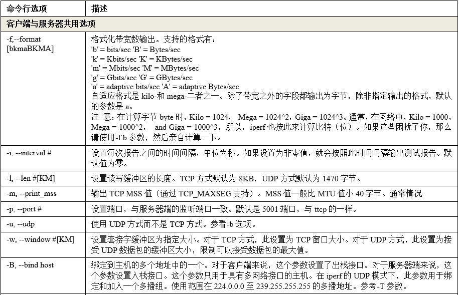
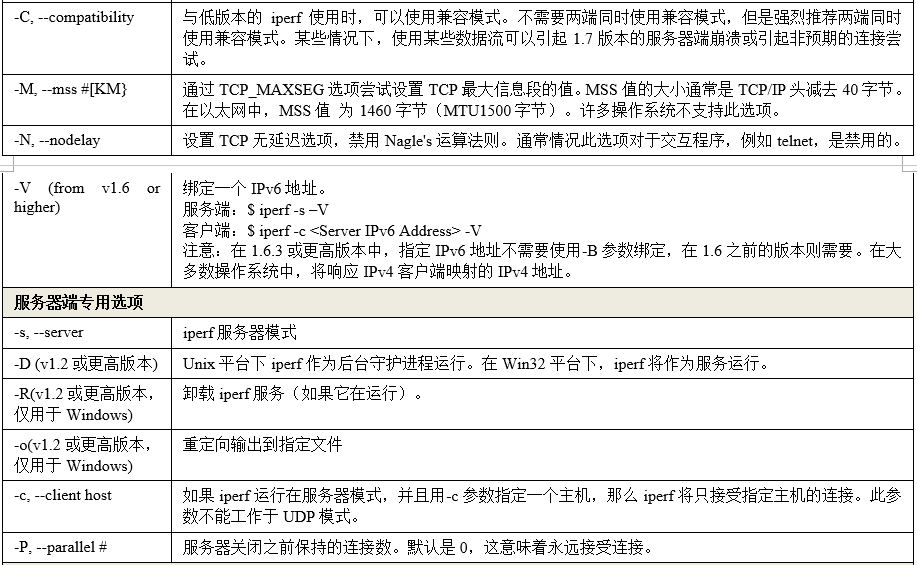
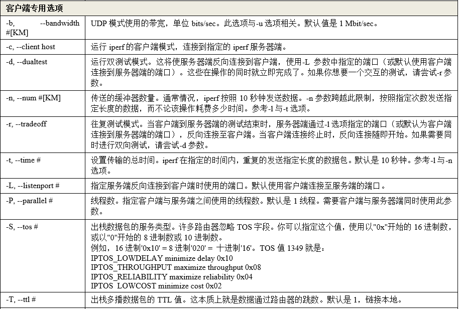
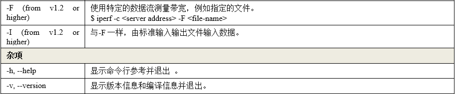


### iperf --help  
```
$ iperf --help
Usage: iperf [-s|-c host] [options]
       iperf [-h|--help] [-v|--version]

Client/Server:
  -b, --bandwidth #[kmgKMG | pps]  bandwidth to send at in bits/sec or packets per second
  -e, --enhancedreports    use enhanced reporting giving more tcp/udp and traffic information
  -f, --format    [kmgKMG]   format to report: Kbits, Mbits, KBytes, MBytes
  -i, --interval  #        seconds between periodic bandwidth reports
  -l, --len       #[kmKM]    length of buffer in bytes to read or write (Defaults: TCP=128K, v4 UDP=1470, v6 UDP=1450)
  -m, --print_mss          print TCP maximum segment size (MTU - TCP/IP header)
  -o, --output    <filename> output the report or error message to this specified file
  -p, --port      #        server port to listen on/connect to
  -u, --udp                use UDP rather than TCP
      --udp-counters-64bit use 64 bit sequence numbers with UDP
  -w, --window    #[KM]    TCP window size (socket buffer size)
  -z, --realtime           request realtime scheduler
  -B, --bind <host>[:<port>][%<dev>] bind to <host>, ip addr (including multicast address) and optional port and device
  -C, --compatibility      for use with older versions does not sent extra msgs
  -M, --mss       #        set TCP maximum segment size (MTU - 40 bytes)
  -N, --nodelay            set TCP no delay, disabling Nagle's Algorithm
  -S, --tos       #        set the socket's IP_TOS (byte) field

Server specific:
  -s, --server             run in server mode
  -t, --time      #        time in seconds to listen for new connections as well as to receive traffic (default not set)
      --udp-histogram #,#  enable UDP latency histogram(s) with bin width and count, e.g. 1,1000=1(ms),1000(bins)
  -B, --bind <ip>[%<dev>]  bind to multicast address and optional device
  -H, --ssm-host <ip>      set the SSM source, use with -B for (S,G)
  -U, --single_udp         run in single threaded UDP mode
  -D, --daemon             run the server as a daemon
  -V, --ipv6_domain        Enable IPv6 reception by setting the domain and socket to AF_INET6 (Can receive on both IPv4 and IPv6)

Client specific:
  -c, --client    <host>   run in client mode, connecting to <host>
  -d, --dualtest           Do a bidirectional test simultaneously
      --ipg                set the the interpacket gap (milliseconds) for packets within an isochronous frame
      --isochronous <frames-per-second>:<mean>,<stddev> send traffic in bursts (frames - emulate video traffic)
  -n, --num       #[kmgKMG]    number of bytes to transmit (instead of -t)
  -r, --tradeoff           Do a bidirectional test individually
  -t, --time      #        time in seconds to transmit for (default 10 secs)
  -B, --bind [<ip> | <ip:port>] bind ip (and optional port) from which to source traffic
  -F, --fileinput <name>   input the data to be transmitted from a file
  -I, --stdin              input the data to be transmitted from stdin
  -L, --listenport #       port to receive bidirectional tests back on
  -P, --parallel  #        number of parallel client threads to run
  -R, --reverse            reverse the test (client receives, server sends)
  -T, --ttl       #        time-to-live, for multicast (default 1)
  -V, --ipv6_domain        Set the domain to IPv6 (send packets over IPv6)
  -X, --peer-detect        perform server version detection and version exchange
  -Z, --linux-congestion <algo>  set TCP congestion control algorithm (Linux only)

Miscellaneous:
  -x, --reportexclude [CDMSV]   exclude C(connection) D(data) M(multicast) S(settings) V(server) reports
  -y, --reportstyle C      report as a Comma-Separated Values
  -h, --help               print this message and quit
  -v, --version            print version information and quit

[kmgKMG] Indicates options that support a k,m,g,K,M or G suffix
Lowercase format characters are 10^3 based and uppercase are 2^n based
(e.g. 1k = 1000, 1K = 1024, 1m = 1,000,000 and 1M = 1,048,576)

The TCP window size option can be set by the environment variable
TCP_WINDOW_SIZE. Most other options can be set by an environment variable
IPERF_<long option name>, such as IPERF_BANDWIDTH.

Source at <http://sourceforge.net/projects/iperf2/>
Report bugs to <iperf-users@lists.sourceforge.net>
```


### iperf3
##### iperf3 选项
iperf3 -h
以下是中文信息， iPerf 3.1.2 支持的所有参数：  
```
-p, --port #，Server 端监听、Client 端连接的端口号； 
-f, --format [kmgKMG]，报告中所用的数据单位，Kbits, Mbits, KBytes, Mbytes； 
-i, --interval #，每次报告的间隔，单位为秒； 
-F, --file name，测试所用文件的文件名。如果使用在 Client 端，发送该文件用作测试；
                 如果使用在 Server 端，则是将数据写入该文件，而不是丢弃； 
-A, --affinity n/n,m，设置 CPU 亲和力； 
-B, --bind ，绑定指定的网卡接口； 
-V, --verbose，运行时输出更多细节； 
-J, --json，运行时以 JSON 格式输出结果； 
--logfile f，输出到文件； 
-d, --debug，以 debug 模式输出结果； 
-v, --version，显示版本信息并退出； 
-h, --help，显示帮助信息并退出。 

Server 端参数： 
-s, --server，以 Server 模式运行； 
-D, --daemon，在后台以守护进程运行； 
-I, --pidfile file，指定 pid 文件； 
-1, --one-off，只接受 1 次来自 Client 端的测试，然后退出。 

Client 端参数：
-c, --client ，以 Client 模式运行，并指定 Server 端的地址； 
-u, --udp，以 UDP 协议进行测试； 
-b, --bandwidth #[KMG][/#]，限制测试带宽。UDP 默认为 1Mbit/秒，TCP 默认无限制； 
-t, --time #，以时间为测试结束条件进行测试，默认为 10 秒； 
-n, --bytes #[KMG]，以数据传输大小为测试结束条件进行测试； 
-k, --blockcount #[KMG]，以传输数据包数量为测试结束条件进行测试； 
-l, --len #[KMG]，读写缓冲区的长度，TCP 默认为 128K，UDP 默认为 8K； 
--cport ，指定 Client 端运行所使用的 TCP 或 UDP 端口，默认为临时端口； 
-P, --parallel #，测试数据流并发数量； 
-R, --reverse，反向模式运行（Server 端发送，Client 端接收）； 
-w, --window #[KMG]，设置套接字缓冲区大小，TCP 模式下为窗口大小； 
-C, --congestion ，设置 TCP 拥塞控制算法（仅支持 Linux 和 FreeBSD ）； 
-M, --set-mss #，设置 TCP/SCTP 最大分段长度（MSS，MTU 减 40 字节）； 
-N, --no-delay，设置 TCP/SCTP no delay，屏蔽 Nagle 算法； 
-4, --version4，仅使用 IPv4； 
-6, --version6，仅使用 IPv6； 
-S, --tos N，设置 IP 服务类型（TOS，Type Of Service）； 
-L, --flowlabel N，设置 IPv6 流标签（仅支持 Linux）； 
-Z, --zerocopy，使用 “zero copy”（零拷贝）方法发送数据； 
-O, --omit N，忽略前 n 秒的测试； 
-T, --title str，设置每行测试结果的前缀； 
--get-server-output，从 Server 端获取测试结果； 
--udp-counters-64bit，在 UDP 测试包中使用 64 位计数器（防止计数器溢出）。 
```

##### iperf3 例子
服务器端（默认端口号5201）：  
`iperf3 -s`  
`iperf3 -s -i 1`  
`iperf3 -s -i 1 -B 192.168.31.121`  
指定端口号：-p port：  
`iperf3 -s -p 8888`  

客户端：  
`iperf3 -c 192.168.31.121`  
`iperf3 -c 192.168.31.121 -i 1`  
`iperf3 -c 192.168.31.121 -i 1 -t 30`  
`iperf3 -c 192.168.31.121 -u -i 1`  
`iperf3 -c 192.168.31.121 -u -b 100M -i 1`  
多个并行数据流-P：  
`iperf3 -c 192.168.31.121 -P 3`  
\--get-server-output 怎么用？​ → 它让客户端拿到服务器端的统计，方便对比两端看到的抖动/丢包差异，从而定位问题方向。  
`iperf3 -c 192.168.31.121 --get-server-output`  

反向测试（服务器端发送数据到客户端）：  
`iperf3 -c 192.168.31.121 -R`  


使用UDP协议，设置使用的带宽：  
`iperf3 -c 192.168.31.121 -b 1000M -t 60 -d`  
-c 为客户端运行并要指定服务端的IP地址  
-b 表示使用的测试带宽  
-t 表示以时间为测试结束条件进行测试，默认为 10 秒  
-d 打印出更详细的debug调试信息  
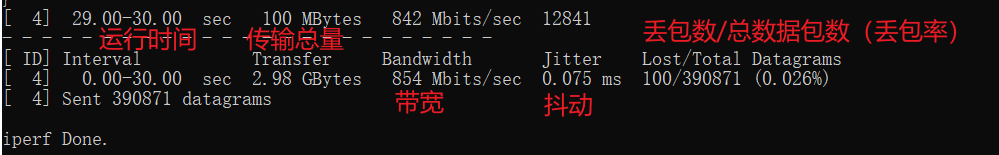  
Interval：程序的运行时间  
Transfer：传输的数据总量  
Bandwidth：测试出的带宽  
Jitter：网路抖动  
Lost/Total Datagrams：丢包数/总数据包数（丢包率）  


##### iperf3 --help
```
$ iperf3 --help
Usage: iperf3 [-s|-c host] [options]
       iperf3 [-h|--help] [-v|--version]

Server or Client:
  -p, --port      #         server port to listen on/connect to
  -f, --format   [kmgtKMGT] format to report: Kbits, Mbits, Gbits, Tbits
  -i, --interval  #         seconds between periodic throughput reports
  -I, --pidfile file        write PID file
  -F, --file name           xmit/recv the specified file
  -A, --affinity n[,m]      set CPU affinity core number to n (the core the process will use)
                             (optional Client only m - the Server's core number for this test)
  -B, --bind      <host>    bind to the interface associated with the address <host>
  -V, --verbose             more detailed output
  -J, --json                output in JSON format
  --json-stream             output in line-delimited JSON format
  --json-stream-full-output output in JSON format with JSON streams enabled
  --logfile f               send output to a log file
  --forceflush              force flushing output at every interval
  --timestamps<=format>     emit a timestamp at the start of each output line
                            (optional "=" and format string as per strftime(3))
  --rcv-timeout #           idle timeout for receiving data (default 120000 ms)
  -d, --debug[=#]           emit debugging output
                            (optional "=" and debug level: 1-4. Default is 4 - all messages)
  -v, --version             show version information and quit
  -h, --help                show this message and quit
Server specific:
  -s, --server              run in server mode
  -D, --daemon              run the server as a daemon
  -1, --one-off             handle one client connection then exit
  --server-bitrate-limit #[KMG][/#]   server's total bit rate limit (default 0 = no limit)
                            (optional slash and number of secs interval for averaging
                            total data rate.  Default is 5 seconds)
  --idle-timeout #          restart idle server after # seconds in case it
                            got stuck (default - no timeout)
  --server-max-duration #   max time, in seconds, that an iperf test can run against the server
Client specific:
  -c, --client <host>[%<dev>] run in client mode, connecting to <host>
                              (option <dev> equivalent to `--bind-dev <dev>`)
  -u, --udp                 use UDP rather than TCP
  --connect-timeout #       timeout for control connection setup (ms)
  -b, --bitrate #[KMG][/#]  target bitrate in bits/sec (0 for unlimited)
                            (default 1 Mbit/sec for UDP, unlimited for TCP)
                            (optional slash and packet count for burst mode)
  --pacing-timer #[KMG]     set the Server timing for pacing, in microseconds (default 1000)
                            (deprecated - for servers using older versions backward compatibility)
  -t, --time      #         time in seconds to transmit for (default 10 secs)
  -n, --bytes     #[KMG]    transmit until the end of the interval when the client sent or received
                            (per direction) at least this number of bytes (instead of -t or -k)
  -k, --blockcount #[KMG]   transmit until the end of the interval when the client sent or received
                            (per direction) at least this number of blocks (instead of -t or -n)
  -l, --length    #[KMG]    length of buffer to read or write
                            (default 128 KB for TCP, dynamic or 1460 for UDP)
  --cport         <port>    bind to a specific client port (TCP and UDP, default: ephemeral port)
  -P, --parallel  #         number of parallel client streams to run
  -R, --reverse             run in reverse mode (server sends, client receives)
  --bidir                   run in bidirectional mode.
                            Client and server send and receive data.
  -w, --window    #[KMG]    set send/receive socket buffer sizes
                            (indirectly sets TCP window size)
  -M, --set-mss   #         set TCP/SCTP maximum segment size (MTU - 40 bytes)
  -N, --no-delay            set TCP/SCTP no delay, disabling Nagle's Algorithm
  -4, --version4            only use IPv4
  -6, --version6            only use IPv6
  -S, --tos N               set the IP type of service, 0-255.
                            The usual prefixes for octal and hex can be used,
                            i.e. 52, 064 and 0x34 all specify the same value.
  --dscp N or --dscp val    set the IP dscp value, either 0-63 or symbolic.
                            Numeric values can be specified in decimal,
                            octal and hex (see --tos above).
  -Z, --zerocopy            use a 'zero copy' method of sending data
  --skip-rx-copy            ignore received messages using MSG_TRUNC option
  -O, --omit N              perform pre-test for N seconds and omit the pre-test statistics
  -T, --title str           prefix every output line with this string
  --extra-data str          data string to include in client and server JSON
  --get-server-output       get results from server
  --udp-counters-64bit      use 64-bit counters in UDP test packets
  --gsro                    enable UDP GSO/GRO on both client and server (client-only option)
  --repeating-payload       use repeating pattern in payload, instead of
                            randomized payload (like in iperf2)
  --dont-fragment           set IPv4 Don't Fragment flag

[KMG] indicates options that support a K/M/G suffix for kilo-, mega-, or giga-

iperf3 homepage at: https://software.es.net/iperf/
Report bugs to:     https://github.com/esnet/iperf
```

### 参考网址
https://www.cnblogs.com/Kimura/p/7514634.html


